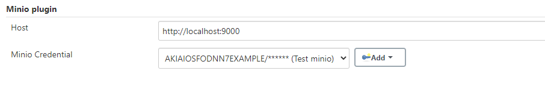
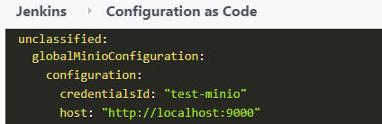
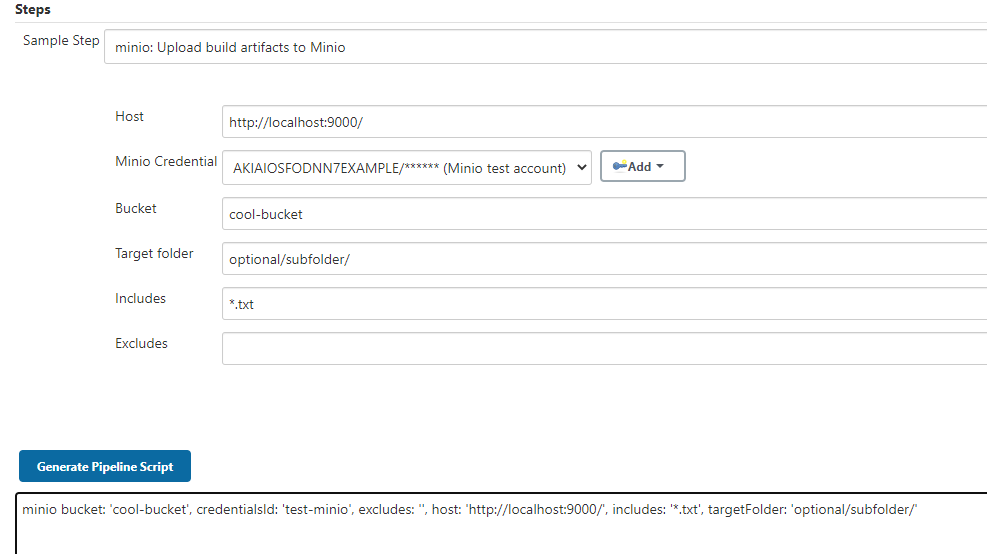
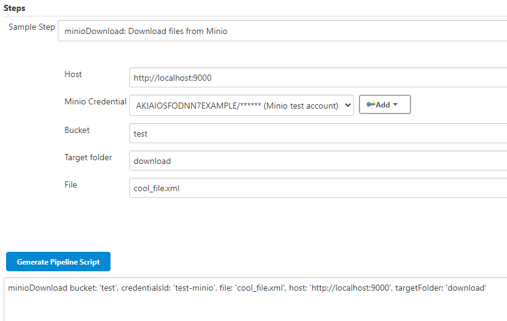

# Minio plugin

Minio plugin for Jenkins.

Plugin is used to work with files in Minio.

## Usage
### Global configuration

### Configuration-as-code

### Example snippet (Upload)

### Example snippet (Download)
